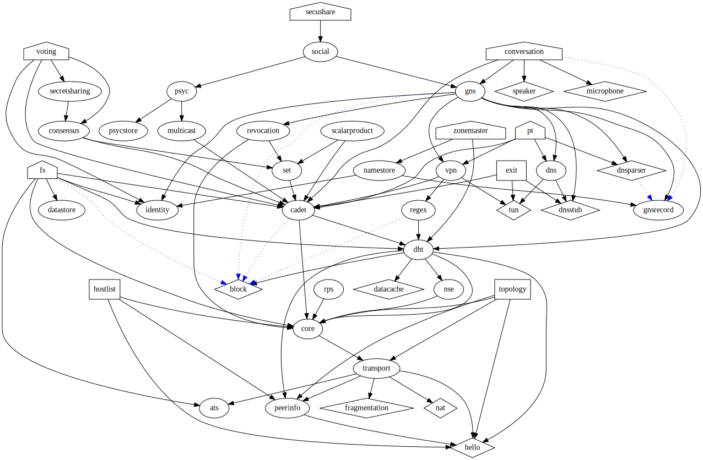

<p align="center">
  <a href="https://gnunet.org"></a>
</p>

> GNUnet is a *new* network protocol stack for building secure, distributed, and privacy-preserving applications. 

* [Install](#how-to-install-gnunet)
  * [From Source](#from-source)
  * [Using Docker](#docker)
* [Using GNUnet](#using-gnunet)
* [License](#license)

How to Install GNUnet
---------------------

### 1. From Source

**Dependencies**

Install these packages. Some of them may need to be installed from source depending on your OS.

```
- libmicrohttpd      >= 0.9.42
- libgcrypt          >= 1.6
- libgnurl           >= 7.35.0      (recommended, available from https://gnunet.org/gnurl)
- libcurl            >= 7.35.0      (alternative to libgnurl)
- libunistring       >= 0.9.2
- gnutls             >= 3.2.12      (highly recommended: a gnutls linked against libunbound)
- libidn             >= 1.0
- libextractor       >= 0.6.1       (highly recommended)
- openssl            >= 1.0         (binary, used to generate X.509 certificate)
- libltdl            >= 2.2         (part of GNU libtool)
- sqlite             >= 3.8         (default database, required)
- mysql              >= 5.1         (alternative to sqlite)
- postgres           >= 9.5         (alternative to sqlite)
- Texinfo            >= 5.2         [*1]
- which                             (for the bootstrap script)
- gettext
- zlib
- pkg-config
```


You can also install the dependencies with the [GNU Guix package manager:](https://https://www.gnu.org/software/guix/) by using the provided environment file: 

```shell
guix package -l guix-env.scm
```


**Using GNU Make**

```shell
./bootstrap # Run this to generate the configure files.
./configure # See the various flags avalable to you.
make
make install
```

**Using the [GNU Guix package manager:](https://https://www.gnu.org/software/guix/)**

```shell
# To build, run tests, and install:
guix package -f guix-env.scm

# To skip the testing phase:
guix package -f guix-env.scm:notest
```


### 2. Docker

```
cd docker
docker build -t gnunet .
```


Using GNUnet
-------------

There are many possible ways to use the subsystems of GNUnet, so we will provide a few examples in this section.

<p align="center">
  <a href="contrib/gnunet-arch-full.svg"></a>
</p>

>***GNUnet is composed of over 30 modular subsystems***


### Cadet

#### Examples

Open a Cadet connection:

```shell
# Node 1
gnunet-cadet -o <shared secret>
```

Conect to peer:

```shell
# Node 2
gnunet-cadet <peer-id of Node 1> <shared secret>
```

#### Sharing Files

With the cli tool, you can also share files:

```shell
# Node 1
gnunet-cadet -o <shared secret> > filename
```

On the Node 2 we're going to send the file to Node 1, and to do this we need to make use of [coprocesses](https://www.gnu.org/software/bash/manual/html_node/Coprocesses.html).
The syntax for using coprocesses varies per shell. In our example we are assuming Bash. More info for different shells can be found [here](https://unix.stackexchange.com/questions/86270/how-do-you-use-the-command-coproc-in-various-shells)

```shell
# Node 2
coproc gnunet-cadet <peer-id of Node 1> <shared secret>
cat <file> >&"${COPROC[1]}"
```

Now this enables us to do some fun things, such as streaming video by piping to a media player:

```shell
# Node 1
gnunet-cadet -o <shared secret> | vlc -
```

```shell
# Node 2
coproc gnunet-cadet <peer-id of Node 1> <shared secret>
cat <video-file> >&"${COPROC[1]}"
```

### GNS

*coming soon*


### VPN

*coming soon*

### Running a Hostlist Server

*coming soon*

GNUnet Configuration
--------------------------
### Examples

```yaml
[transport]
OPTIONS = -L DEBUG
PLUGINS = tcp
#PLUGINS = udp

[transport-tcp]
OPTIONS = -L DEBUG
BINDTO = 192.168.0.2
```

TODO: *explain what this does and add more*


Philosophy
-------------------------


Related Projects
-------------------------


 <a href="https://pep.foundation"></a>  <a href="https://secushare.org"></a>

 
